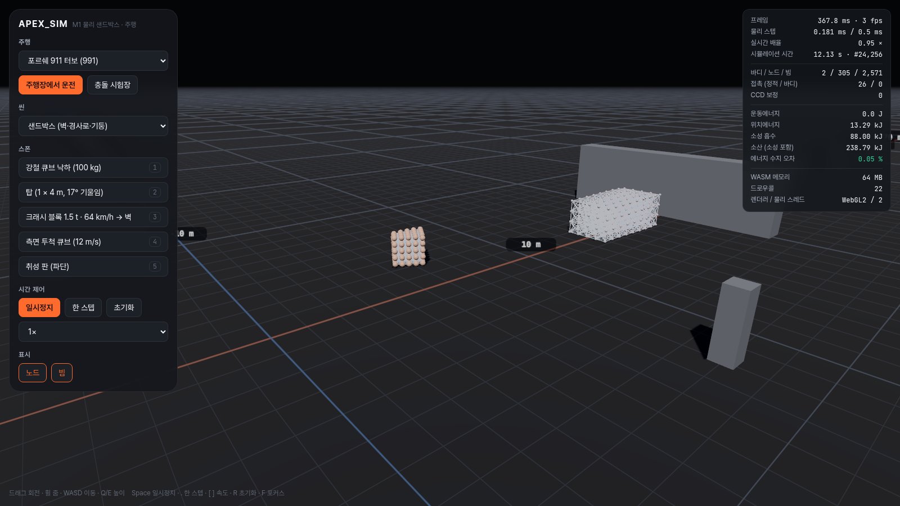

# APEX_SIM

노드-빔(node-beam) 소프트바디로 모든 차량이 시뮬레이션되는 3D 드라이빙·레이싱 시뮬레이터의 **웹 버전**이다.
물리 코어 `SoftBodyCore`는 엔진 독립 C++20 라이브러리이고, 네이티브(테스트·CLI·벤치)와 WASM(SIMD128 + 멀티스레드) 두 가지로 빌드한다.
렌더러는 Three.js `WebGPURenderer`(WebGL2 폴백)다.

- 현재 단계: **M0 기반 — 완료** (진행 현황: [ROADMAP.md](ROADMAP.md) · 요구사항 추적: [REQUIREMENTS.md](REQUIREMENTS.md))
- 설계: [ARCHITECTURE.md](ARCHITECTURE.md) · 착수 결정: [KICKOFF.md](KICKOFF.md) · 알려진 문제: [KNOWN_ISSUES.md](KNOWN_ISSUES.md) · 변경 이력: [CHANGELOG.md](CHANGELOG.md)



## 요구 사항

| 도구 | 버전 | 비고 |
|---|---|---|
| Node.js | 22 이상 | WASM 스레드 테스트, Vite |
| CMake + Ninja | 3.24 이상 | 코어 빌드 |
| C++20 컴파일러 | GCC 13 / Clang 18 이상 | 네이티브 빌드 |
| Emscripten | 6.0.10 (고정) | `source tools/setup-emsdk.sh`가 설치한다 |
| 브라우저 | Chrome·Edge 최신판 권장 | WebGPU 우선, 없으면 WebGL2. `SharedArrayBuffer`가 필요하다 |

## 빌드·실행

```bash
npm install
npm run core:test          # 네이티브 코어 빌드 + 테스트 30종 (§23.1)
source tools/setup-emsdk.sh
npm run wasm:build         # WASM 모듈 → web/public/wasm/
npm run core:test:wasm     # 같은 테스트를 WASM(Node)으로 — 골든 해시가 네이티브와 같아야 통과
npm run dev                # http://localhost:5173 (COOP/COEP 헤더 포함)
```

기타 명령:

```bash
npm test                   # 웹 단위 테스트 (Vitest)
npm run build              # 타입 검사 + 배포용 번들 (dist/)
npm run build && npm run test:e2e   # 헤드리스 Chromium: 브라우저 골든 해시 · 스크린샷 · 벤치
npm run bench              # 네이티브 물리 벤치 (큐브 16개)
./build/native-release/sbc-cli run wall_crash --seconds 1.5 --energy   # 에너지 수지 출력
```

URL 옵션: `?scene=sandbox|cube_drop|tower|wall_crash|pile|golden_m0`, `?golden=1`(브라우저 결정론 자가 검사), `?bench=1`(벤치 JSON), `?backend=webgl2`(WebGL2 강제), `?lang=en`.

### 배포

WASM 스레드와 트리플 버퍼는 `SharedArrayBuffer`를 쓰므로 페이지가 교차 출처 격리 상태여야 한다.
`dist/_headers`는 Cloudflare Pages·Netlify용 COOP/COEP 설정이다. `file://`로 열면 동작하지 않는다.

## 조작 (M0 샌드박스)

| 동작 | 입력 |
|---|---|
| 카메라 회전 / 줌 | 마우스 드래그 / 휠 |
| 카메라 이동 / 높이 | W A S D (Shift 가속) / Q E |
| 프리셋 스폰 | 1 큐브 · 2 탑 · 3 크래시 블록 64 km/h · 4 투척 큐브 · 5 취성 판 |
| 일시정지 / 한 스텝 / 100 스텝 | Space / `.` / `,` |
| 슬로모션 | `[` 느리게 · `]` 빠르게 (1/2 ~ 1/100) |
| 씬 초기화 / 마지막 바디로 포커스 | R / F |

## 디렉터리

```
core/      SoftBodyCore (C++20): include/sbc, src, tests(Catch2), cli(sbc-cli), bindings/wasm
web/       웹 클라이언트 (TypeScript + Vite + three.js): physics(워커·트리플 버퍼), render, ui
data/      데이터 드리븐 정의 (스폰 프리셋 등)
tools/     emsdk 설치, WASM 빌드, E2E
bench/     벤치 결과 JSON (마일스톤별)
docs/      스크린샷, 포맷 문서
```
